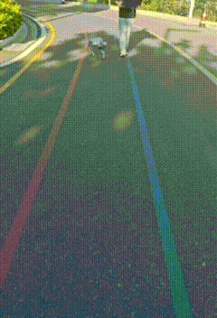

# SingleDINOv2Nav

基于 **ViPlanner** 思想、使用**单个冻结 DINOv2** 骨干的端到端局部导航模型。输入一张 **RGB 图像 + 一个目标点**，直接输出 **5 个路径关键点 + 碰撞概率（fear）**，**无需深度图输入**。

<div align="center">
  
</div>

本项目是原 ViPlanner 的变体：用 **冻结的 DINOv2 多尺度特征 + 完整 DPT（RefineNet）融合**替换原「DINOv2 最后一层 + PlannerNet 深度编码器」的双编码器结构，从而去掉深度图依赖，仅凭 RGB 完成端到端轨迹规划。

## 模型结构

```
输入 RGB (B,3,360,640)                    ── 唯一视觉输入
        │
        ▼
DINOv2(vitb14) 冻结 ── 提取 4 层中间特征    ── 层索引 [2,5,8,11]
        │
        ▼
完整 DPT 融合头 (Conv1×1 + Resize + RefineNet×4)   ← CLS token 注入
        │
        ▼
1024 × 12 × 20 空间特征图
        │
        ▼
ViPlanner Decoder (复用, 未改动)
        ├── 5 个路径关键点 keypoints (B,5,2)
        └── 碰撞概率 fear (B,1)
```

| | 原始 ViPlanner | 本项目 SingleDINOv2Nav |
|---|---|---|
| 视觉编码 | DINOv2(最后层)→512 + PlannerNet(深度)→512 | DINOv2(4 个中间层)→完整 DPT 融合 |
| 深度图 | 需要 | **不需要**（仅 RGB） |
| 特征输出 | 512+512 → Concat → 1024×12×20 | DPT → 1024×12×20 |
| Decoder | 原始 | 完全复用 |

## 项目结构

```
.
├── config/single_dinov2.yaml     # 模型 / 损失 / 训练超参数
├── data/
│   ├── dataset.py                # CARLA 数据集加载
│   ├── preprocess*.py            # 离线预处理
│   └── rebuild_costmaps.py       # 代价图重建
├── model/
│   ├── single_dinov2_nav.py      # 主模型 (DINOv2 + DPT + Decoder)
│   ├── dinov2_encoder.py         # 冻结 DINOv2 编码器
│   └── encoder.py                # ResNet 风格编码器 (备用)
├── utils/
│   ├── depth.py / semantic.py    # 深度估计 / 语义分割 (代价图用)
│   ├── cost_map_builder.py       # 代价图构建
│   └── cost_map_align.py         # 代价图坐标对齐
├── scripts/rebuild_costmaps.py   # 批量重建代价图
├── evaluation/evaluate_p0.py     # 论文 P0 核心指标评测
├── train.py                      # 训练 + 验证可视化
├── infer.py                      # 单图推理 (3 面板可视化)
├── predict.py                    # 纯推理 (最小依赖)
├── batch_infer.py                # 批量推理
├── benchmark*.py                 # 推理速度基准
└── loss.py                       # ViPlanner 损失 (Goal+Obs+Motion+Fear)
```

## 损失函数

完全参照 ViPlanner `TrajCost.CostofTraj`，四项加权求和：

```
Loss = w_goal·Goal + w_obs·Obstacle + w_motion·Motion + w_fear·Fear
```

- **Goal Loss** — 终点误差 `log(‖wp[-1] - goal‖ + 1)`
- **Obstacle Loss** — 3 轨扩展（机器人半宽 ±0.3m）在代价图上采样求和
- **Motion Loss** — Hermite 插值后 51 个路径点实际步长 vs 理想步长差
- **Fear Loss** — 前方 `fear_ahead_dist` 米内最大代价超阈值 → 碰撞标签，BCE 监督

5 个关键点经 **Hermite 插值**得到 51 个路径点。

## 快速开始

### 环境要求
- Python 3.10+
- PyTorch + CUDA
- 依赖：`tqdm`, `numpy`, `opencv-python`, `matplotlib`, `pyyaml`, `torchvision`
- DINOv2 预训练权重（`checkpoints/dinov2_vitb14_pretrain.pth`，或 torch hub cache 自动加载）

### 训练

```bash
python train.py                                # 默认配置
python train.py --data_dir D:/carla/carla_data
python train.py --epochs 20
python train.py --resume .../last.pth          # 断点续训
```

### 推理

```bash
# 完整推理: RGB + 目标 → 3 面板可视化 (RGB / 轨迹 / 代价图)
python infer.py --image path/to/image.jpg --goal_x 2.0 --goal_z 5.0 \
                --ckpt results/single_dinov2_run/checkpoints/best.pth

# 纯推理: 最小依赖, 仅输出 5 个关键点 (适合集成到导航管线)
python predict.py --image path/to/image.jpg --goal_x 2.0 --goal_z 5.0 \
                  --ckpt results/single_dinov2_run/checkpoints/best.pth
```

坐标约定：`goal_x` 为右方向 (x)，`goal_z` 为前方向 (z)，单位米。

### 基准测试与评测

```bash
python benchmark_speed.py        # 端到端推理速度
python evaluation/evaluate_p0.py --ckpt .../best.pth --data_dir D:/testdata/processed
```

## 评测结果

在 CARLA 测试集上通过 `evaluate_p0.py` 评测（成功 = FDE<0.5m 且无碰撞，FPS 约 **20**，推理约 **50 ms/step**）：

| 数据集 | 样本数 | ADE (m) | FDE (m) | 碰撞率 | 成功率 |
|---|---|---|---|---|---|
| testdata (主) | 1615 | 0.091 | 0.059 | 4.0% | 95.7% |
| testdata2 (泛化) | 962 | 0.137 | 0.099 | 20.2% | 79.5% |

> 具体数值随训练轮次、数据划分与随机种子变化，请以实际运行 `evaluate_p0.py` 为准。

## 参考

- **ViPlanner** — 基线方法（轨迹生成 + 代价损失核心思路）
- **Depth-Anything-V2** — DPT 融合结构 + DINOv2 多尺度特征提取
- **DINOv2** — 冻结视觉骨干（vitb14）
